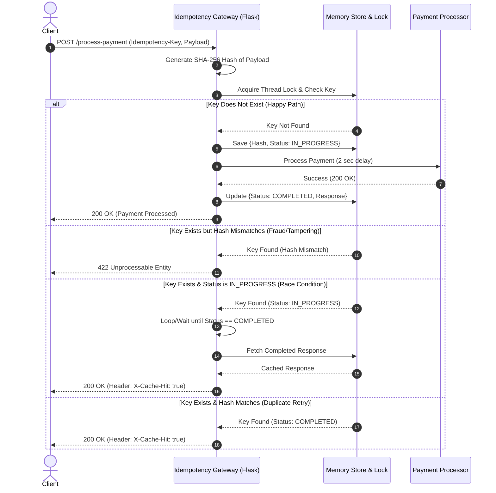

# Idempotency-Gateway (The "Pay-Once" Protocol)

## 1. Project Overview
The Idempotency Gateway is a lightweight RESTful API middleware built in Python and Flask. It acts as a safety layer for payment processing, ensuring that no matter how many times a client retries a payment request due to network timeouts, the transaction is processed **exactly once**. It protects against accidental double-charging, intercepts fraudulent payload tampering, and safely handles parallel race conditions.

---

## 2. Architecture Diagram

The following sequence diagram outlines the data flow for the Idempotency Gateway, including the handling of new requests, cached duplicates, payload tampering, and in-flight race conditions.


## 3. API Documentation

### **Endpoints**

* **`POST /process-payment`**
    * **Description:** Processes a simulated payment. Requires an idempotency key to prevent double-charging on retries.
    * **Required Headers:**
        * `Content-Type: application/json`
        * `Idempotency-Key: <any-unique-string>`
    * **Expected Payload:** JSON object containing `amount` (int) and `currency` (string).

---

### **Example Requests**

*Note: For testing on Windows/PowerShell, create a `data.json` file in the root directory to prevent command-line parsing errors:*
`{"amount": 100, "currency": "GHS"}`

**1. The First Request (Happy Path)**
Sends a brand new payment request.
* **Command:**
    ```powershell
    curl.exe -i -X POST [http://127.0.0.1:5000/process-payment](http://127.0.0.1:5000/process-payment) -H "Content-Type: application/json" -H "Idempotency-Key: key-123" -d "@data.json"
    ```
* **Expected Result:** The server pauses for 2 seconds (simulating processing) and returns a `200 OK` with `{"status": "Charged 100 GHS"}`.

**2. The Duplicate Request (Idempotency Check)**
Sends the exact same request again to simulate a network retry.
* **Command:**
    ```powershell
    curl.exe -i -X POST [http://127.0.0.1:5000/process-payment](http://127.0.0.1:5000/process-payment) -H "Content-Type: application/json" -H "Idempotency-Key: key-123" -d "@data.json"
    ```
* **Expected Result:** The server returns **instantly** (no 2-second delay) with a `200 OK` and a custom `X-Cache-Hit: true` header.

**3. The Fraudulent Request (Payload Tampering Check)**
Changes the payment amount but tries to reuse an existing idempotency key.
* **Setup:** Change the amount in your local `data.json` to `500`.
* **Command:**
    ```powershell
    curl.exe -i -X POST [http://127.0.0.1:5000/process-payment](http://127.0.0.1:5000/process-payment) -H "Content-Type: application/json" -H "Idempotency-Key: key-123" -d "@data.json"
    ```
* **Expected Result:** The server detects the payload hash mismatch and instantly blocks the request, returning a `422 UNPROCESSABLE ENTITY` with an error message.

---

## 4. Design Decisions & Developer's Choice

### **Developer's Choice: SHA-256 Payload Hashing for Memory Efficiency & Security**
To fulfill User Story 3 (fraud/tamper detection), the system needs a way to verify that a duplicate request contains the exact same payload as the original. Instead of storing massive JSON payloads in the server's memory, I implemented a **SHA-256 hashing mechanism**. 

When a payload arrives, it is immediately converted into a tiny, fixed-length 64-character hash. The system only stores this hash. If a client attempts to reuse a key but changes a single digit in the payload (e.g., changing the amount from 100 to 500), the hash completely changes, allowing the gateway to instantly block the request with a `422 Unprocessable Entity`.

* **Crucial Detail (`sort_keys=True`):** In JSON, key order is not guaranteed. `{"amount": 100, "currency": "GHS"}` and `{"currency": "GHS", "amount": 100}` represent the same logical request but would generate entirely different hashes. To prevent false positives, the API parses the JSON using `json.dumps(payload, sort_keys=True)`, ensuring the data is strictly normalized before hashing.

### **Bonus Story: Concurrency & Thread Locking**
To prevent "In-Flight" race conditions where two identical requests hit the server at the exact same millisecond, I utilized Python's `threading.Lock()`. 

When Request A arrives, it locks the dictionary, claims the key, and marks the status as `IN_PROGRESS` before releasing the lock and beginning the heavy processing step. If Request B arrives a millisecond later, it must wait for the lock. Once it accesses the dictionary, it sees the `IN_PROGRESS` state and enters a non-blocking wait loop. As soon as Request A finishes, Request B safely fetches the cached data without ever triggering a duplicate backend process.
