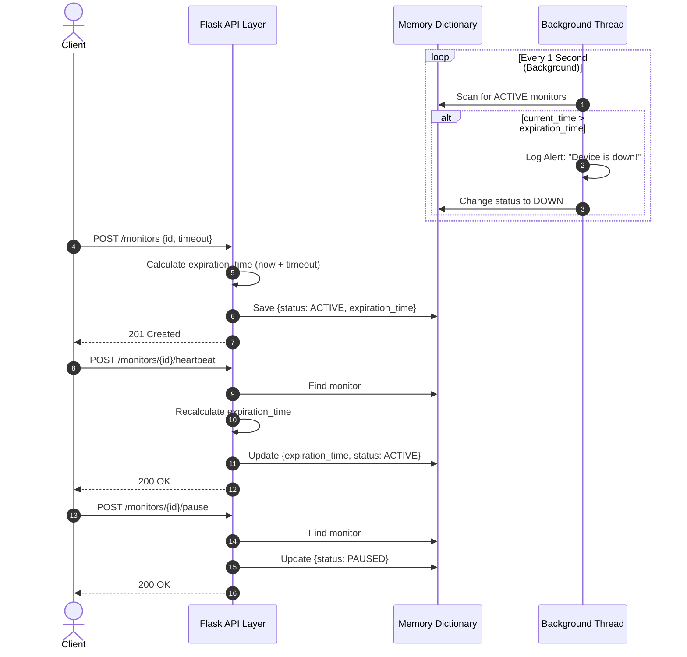

# Pulse-Check-API ("Watchdog" Sentinel)

## 1. Project Overview
The Pulse-Check API is a "Dead Man's Switch" backend service built for CritMon Servers Inc. It actively monitors remote infrastructure (like solar farms and weather stations) in low-connectivity areas. Devices register a countdown timer and send periodic heartbeats to stay alive. If a device fails to check in before its timer hits zero, a background Watcher Thread automatically fires a critical alert so maintenance teams can be deployed.

---

## 2. Architecture Diagram

The following sequence diagram outlines the asynchronous architecture, showing how the background Watcher Thread operates independently from the main Flask API to trigger alerts when timers expire.



sequenceDiagram
    autonumber
    actor Device as Remote Device
    participant API as Flask API Layer
    participant Lock as Thread Lock
    participant Store as In-Memory Store
    participant Disk as state.json File
    participant Watcher as Background Watcher

    box rgb(240, 240, 240) Background Monitoring
    participant Watcher
    participant Lock
    participant Store
    participant Disk
    end

    box rgb(255, 255, 255) API Interaction
    participant Device
    participant API
    end

    %% WATCHER LOOP
    loop Every 1 Second
        Watcher->>Lock: Acquire Lock (block endpoints)
        
        alt ACTIVE Monitors exist
            Watcher->>Store: Scan monitors for timeouts
            
            note right of Watcher: Condition: currentTime > expirationTime
            alt Device timed out
                Watcher->>Watcher: 🚨 LOG CRITICAL ALERT to Console
                Watcher->>Store: Set Status to DOWN
                Watcher->>Disk: Overwrite state.json (Persist DOWN state)
            else Device is safe
                Watcher->>Watcher: Do Nothing
            end
        end
        
        Watcher->>Lock: Release Lock
    end

    %% ENDPOINT: CREATE
    note over Device,API: POST /monitors {id, timeout, email}
    Device->>API: Send Registration Request
    API->>API: Compute expirationTime (currentTime + timeout)
    API->>Lock: Acquire Lock (block Watcher)
    API->>Store: Save monitor (status: ACTIVE)
    API->>Disk: Overwrite state.json (Persist ACTIVE state)
    API->>Lock: Release Lock
    API-->>Device: HTTP 201 Created

    %% ENDPOINT: HEARTBEAT
    note over Device,API: POST /monitors/{id}/heartbeat
    Device->>API: Send Check-in Request
    API->>Lock: Acquire Lock (block Watcher)
    API->>Store: Recalculate expirationTime & set status ACTIVE
    API->>Disk: Overwrite state.json (Persist Reset state)
    API->>Lock: Release Lock
    API-->>Device: HTTP 200 OK

## 3. API Documentation

### **Endpoints**

* **`POST /monitors`**
    * **Description:** Registers a new device and starts its countdown timer.
    * **Expected Payload:** `{"id": "string", "timeout": int, "alert_email": "string"}`

* **`POST /monitors/<device_id>/heartbeat`**
    * **Description:** Resets the countdown timer for a specific device back to its original full duration.
    * **Expected Payload:** None.

* **`POST /monitors/<device_id>/pause`**
    * **Description:** Snoozes the monitor. The background watcher will ignore this device until a new heartbeat is received.
    * **Expected Payload:** None.

---
## 4. Design Decisions & Developer's Choice

### **Developer's Choice: Crash Recovery via Persistent Storage**
**The Problem:** The Dead Man's Switch relies heavily on a stateful, in-memory dictionary. If the API server crashes, restarts, or is redeployed, the memory is wiped clean. The system would silently lose track of every active monitor, and CritMon would be unaware if devices went offline during the blackout.

**The Solution:** I implemented a persistent storage mechanism using file I/O (`state.json`). 
* Whenever a monitor is registered, paused, or receives a heartbeat, the application acquires a thread lock and dumps the updated dictionary to disk.
* Upon startup, the application checks for `state.json`. If it exists, it safely loads the data back into memory before starting the Watcher Thread. 
* This ensures that even if the server violently crashes and reboots, the countdown timers are instantly restored and no alerts are missed.

### **Bonus Story: The Watcher Thread & Snooze Button**
To handle proactive alerting without blocking the main API, I implemented a `Daemon Thread` using Python's `threading` module. This Watcher Loop runs continuously in the background, waking up every 1 second to compare the current Unix time against the calculated `expiration_time` of all active monitors. 

To implement the requested "Snooze" feature, I utilized a simple State Machine (`ACTIVE`, `PAUSED`, `DOWN`). When the `/pause` endpoint is hit, the device status is changed to `PAUSED`, causing the background thread to safely ignore it during its checks.

### **Example Requests (Windows/PowerShell)**

*Note: For testing the creation endpoint on Windows/PowerShell, create a `device.json` file in the root directory:*
`{"id": "solar-array-1", "timeout": 10, "alert_email": "admin@critmon.com"}`

**1. Register a Monitor**
```powershell
curl.exe -i -X POST [http://127.0.0.1:5000/monitors](http://127.0.0.1:5000/monitors) -H "Content-Type: application/json" -d "@device.json"
