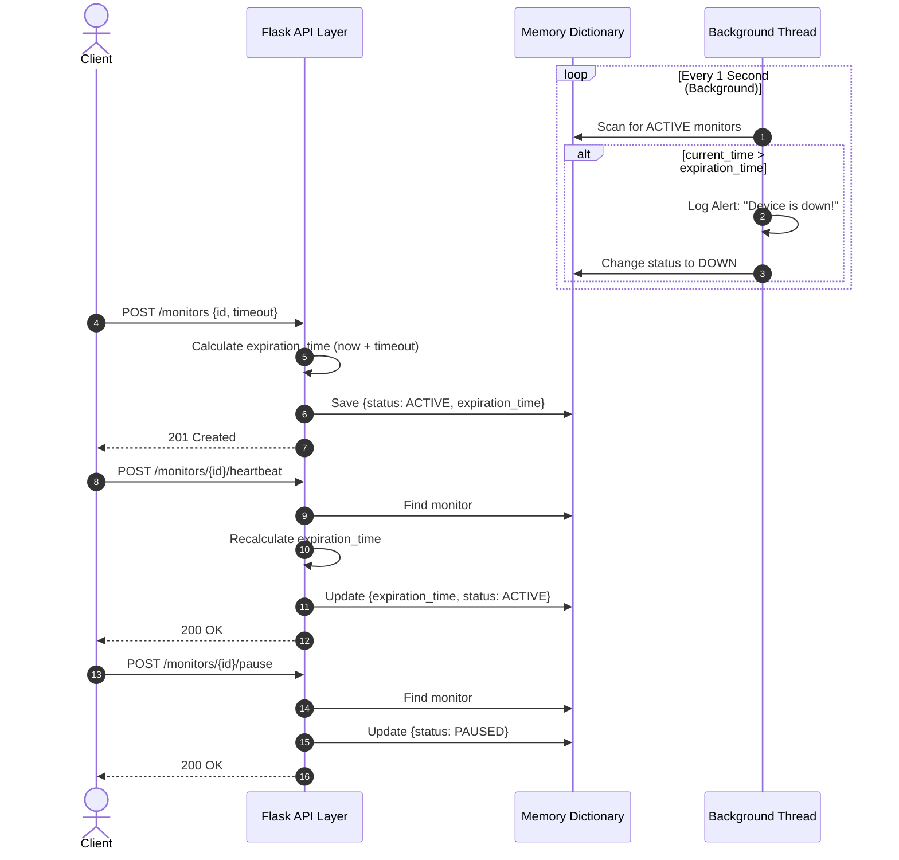

# Pulse-Check-API ("Watchdog" Sentinel)

## 1. Project Overview
The Pulse-Check API is a "Dead Man's Switch" backend service built for CritMon Servers Inc. It actively monitors remote infrastructure (like solar farms and weather stations) in low-connectivity areas. Devices register a countdown timer and send periodic heartbeats to stay alive. If a device fails to check in before its timer hits zero, a background Watcher Thread automatically fires a critical alert so maintenance teams can be deployed.

---

## 2. Architecture Diagram

The following sequence diagram outlines the asynchronous architecture, showing how the background Watcher Thread operates independently from the main Flask API to trigger alerts when timers expire.

sequenceDiagram
    autonumber
    actor Client
    participant API as Flask API Layer
    participant Store as Memory Dictionary
    participant Watcher as Background Thread

    %% The Asynchronous Background Loop
    loop Every 1 Second (Background)
        Watcher->>Store: Scan for ACTIVE monitors
        alt current_time > expiration_time
            Watcher->>Watcher: Log Alert: "Device is down!"
            Watcher->>Store: Change status to DOWN
        end
    end

    %% User Story 1: Registration
    Client->>API: POST /monitors {id, timeout}
    API->>API: Calculate expiration_time (now + timeout)
    API->>Store: Save {status: ACTIVE, expiration_time}
    API-->>Client: 201 Created

    %% User Story 2: Heartbeat
    Client->>API: POST /monitors/{id}/heartbeat
    API->>Store: Find monitor
    API->>API: Recalculate expiration_time
    API->>Store: Update {expiration_time, status: ACTIVE}
    API-->>Client: 200 OK

    %% Bonus: Pause/Snooze
    Client->>API: POST /monitors/{id}/pause
    API->>Store: Find monitor
    API->>Store: Update {status: PAUSED}
    API-->>Client: 200 OK
